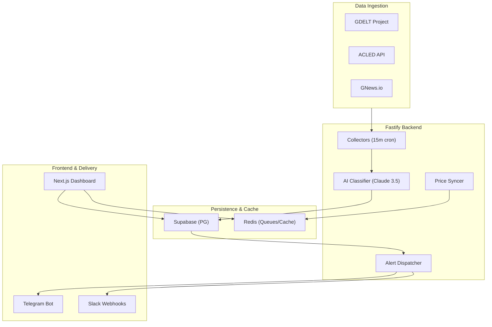

# Blue Beacon Research — Tactical Intelligence Terminal

> **Geopolitical Risk Intelligence → Actionable Market Signals**

Blue Beacon Research is a real-time geopolitical intelligence platform that automatically collects conflict and political risk events from external data sources (GDELT, ACLED, and GNews), classifies them using Claude AI, and converts them into structured "signals" scored by severity and commodity market impact.

## 🚀 Key Features

- **Autonomous Intelligence Pipeline**: Ingests up to 350+ new world events every 15 minutes.
- **AI Signal Mapping**: Bridges raw geopolitical news with financial market predictions (Oil, Gold, Natural Gas).
- **Multi-Channel Alerting**: Instant dispatch via Telegram, Slack, Webhooks, and Push for severity ≥ 7 events.
- **Tactical Dashboard & Map**: High-fidelity dark-mode interface with interactive conflict hotspots.
- **Backtesting Engine**: Historical analysis of geopolitical triggers on market volatility.

## 🏗 System Architecture



## 🛠 Getting Started

### 1. Prerequisites
- **Node.js**: >= 18.0.0
- **pnpm**: >= 8.0.0
- **Supabase**: Account and active project.

### 2. Environment Setup
Every package requires specific environment variables. We provide templates in `.env.example`.

```sh
# Root Setup
cp .env.example .env

# App Setup
cp apps/web/.env.example apps/web/.env
cp apps/api/.env.example apps/api/.env
```

> [!IMPORTANT]
> **Security Protocol**: Never commit `.env` files to Git. We have sanitized the `.env.example` templates, but you must populate the local `.env` with your own rotated keys.

### 3. Installation & Development
```sh
pnpm install
pnpm dev
```

## 📂 Documentation

Detailed technical guides and project walkthroughs are available in the artifacts directory:
- **[Walkthrough](./docs/terminal-export/walkthrough.md)**: Visual guide to all tactical modules.
- **[API & Data Flow Audit](./docs/terminal-export/api_flow_audit.md)**: Deep-dive into the ingestion and AI enrichment pipeline.
- **[Production Readiness Guide](./docs/terminal-export/production_readiness_guide.md)**: Critical security and deployment protocols.

## ✅ Production Checklist
- [x] Sanitized environment templates.
- [x] Implemented rate-limiting via Upstash.
- [x] Configured Sentry error tracking.
- [x] Verified 1:1 visual parity with Stitch design system.

---
*BB-ALPHA MAIN CONTROL: v1.0.0*
