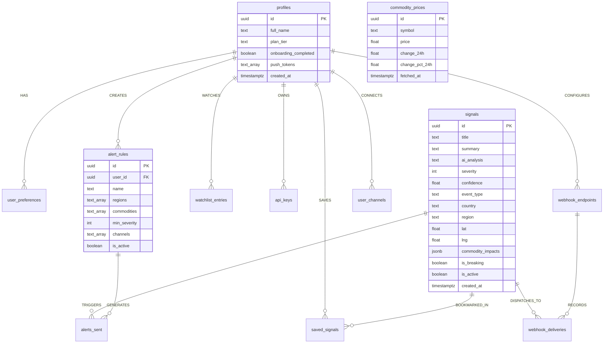

# Blue Beacon Research — Complete System Architecture & Repository Analysis

> **Executive Summary**: Blue Beacon Research is an enterprise-grade, real-time geopolitical risk intelligence platform that transforms raw global conflict data into actionable financial trading signals (Oil, Gold, Natural Gas, FX, Commodities) using automated AI synthesis (Anthropic Claude 3.5), sub-second alert dispatchers, interactive GIS conflict maps, and quantitative backtesting engines.

---

## 📑 Table of Contents

1. [Executive Overview & Business Value](#1-executive-overview--business-value)
2. [High-Level Architecture & Tech Stack](#2-high-level-architecture--tech-stack)
3. [Full Repository Folder & File Structure](#3-full-repository-folder--file-structure)
4. [Database Schema & Data Model](#4-database-schema--data-model)
5. [End-to-End Data & Execution Flows (Diagrams)](#5-end-to-end-data--execution-flows-diagrams)
6. [Comprehensive Page-by-Page & Component Breakdown](#6-comprehensive-page-by-page--component-breakdown)
7. [Detailed Module & File Descriptions](#7-detailed-module--file-descriptions)
8. [User & Product Journeys](#8-user--product-journeys)
9. [Infrastructure, Hosting & Service Cost Breakdown](#9-infrastructure-hosting--service-cost-breakdown)
10. [Technical Audit & Verification Matrix (Claude Audit Responses)](#10-technical-audit--verification-matrix-claude-audit-responses)

---

## 1. Executive Overview & Business Value

### What Does This Repository Do?
Blue Beacon Research acts as a **Tactical Intelligence Terminal** for institutional traders, commodities risk managers, hedge funds, and geopolitical analysts. 

- **Autonomous Ingestion**: Ingests up to 350+ conflict events every 15 minutes from global news sources (**GDELT Project**, **ACLED**, **GNews API**).
- **AI Signal Generation**: Uses **Anthropic Claude 3.5 Sonnet** and **Claude 3.5 Haiku** to score conflict severity (1–10), assess neural confidence (0–100%), determine commodity market impact (e.g., `USOIL` bullish, `GOLD` volatile), and synthesize military/geopolitical intelligence briefings.
- **Sub-second Multi-Channel Alerting**: Instant dispatch via **Telegram Bots**, **Slack Webhooks**, **Custom HTTP Webhooks**, and **Expo Mobile Push Notifications** for high-severity events (severity $\ge$ 7 or 8).
- **Backtesting & Simulation**: Allows risk managers to run backtests of signal performance against historical commodity price movements (Alpha Vantage data).
- **Gating & Access Tiers**: Includes built-in feature flagging and waitlist access controls to gate public access before product launches while supporting multi-tiered subscription pricing (**Free**, **Analyst**, **Pro**, **API**).

---

## 2. High-Level Architecture & Tech Stack

The workspace is structured as a **Turborepo Monorepo** using **pnpm workspaces**.


```
                           ┌─────────────────────────────────────────┐
                           │          Client Applications            │
                           │  - Next.js 16 Web Terminal (Vercel)     │
                           │  - Expo / React Native Mobile App       │
                           └────────────────────┬────────────────────┘
                                                │
                                                ▼
 ┌─────────────────────────────────────────────────────────────────────────────────────────┐
 │                                   Backend API Layer                                     │
 │  Fastify REST API (Swagger OpenAPI) | Supabase Auth (@supabase/ssr / JWT) | Plan Guard  │
 └──────────────┬───────────────────────────────┬───────────────────────────────┬──────────┘
                │                               │                               │
                ▼                               ▼                               ▼
 ┌──────────────────────────────┐ ┌───────────────────────────┐ ┌───────────────────────────┐
 │     PostgreSQL Database      │ │   Redis Cache & Queues    │ │       AI Engine           │
 │  Supabase (RLS Policies)     │ │ Upstash Redis & BullMQ    │ │ Anthropic Claude 3.5      │
 └──────────────────────────────┘ └───────────────────────────┘ └───────────────────────────┘
                ▲                               ▲
                │                               │
 ┌──────────────┴───────────────────────────────┴──────────────────────────────────────────┐
 │                               Async Background Workers                                  │
 │ Cron Ingestion (GDELT, ACLED, GNews) → AI Classifier → Signal Gen → Alert Dispatcher    │
 └─────────────────────────────────────────────────────────────────────────────────────────┘
```

### Technology Matrix & Versions

| Layer | Technology / Package | Version | Purpose / Role | Licensing / Pricing |
| :--- | :--- | :--- | :--- | :--- |
| **Monorepo Manager** | Turborepo + pnpm | `turbo@2.8.18`, `pnpm@10.32.1` | Build orchestration, caching, package linking | Open Source (Free) |
| **Web Framework** | Next.js (App Router) | `16.2.0` (React `19.2.4`) | High-performance terminal UI, SSR, API proxy | Open Source / Vercel (Free tier / $20/mo Pro) |
| **Styling & UI** | TailwindCSS v4 + Lucide | `tailwindcss@4`, `lucide-react` | Dark-mode terminal design, glassmorphism, responsive UI | Open Source (Free) |
| **Mapping Engine** | Mapbox GL JS | `3.20.0` | High-fidelity interactive conflict heatmap & GIS | Freemium (50,000 free map loads/mo) |
| **Backend Framework** | Fastify | `5.8.2` | High-throughput ESM REST API backend | Open Source (Free) |
| **Async Queues** | BullMQ + ioredis | `bullmq@5.71.0`, `ioredis@5.9.3` | Reliable background worker queues with exponential backoff | Open Source (Free) |
| **Cron Scheduling** | node-cron | `4.2.1` | Recurring data collectors (15-min & daily intervals) | Open Source (Free) |
| **Database & Auth** | Supabase PostgreSQL | `supabase-js@2.99.2` | Postgres relational DB, Row Level Security, Auth | Managed Cloud (Free tier / $25/mo Pro) |
| **Cache & Broker** | Upstash Redis | `@upstash/redis@1.37.0` | Edge rate limiting & BullMQ Redis protocol connection | Serverless Redis (Free tier / Pay-as-you-go) |
| **AI Intelligence** | Anthropic Claude SDK | `@anthropic-ai/sdk@0.79.0` | Claude 3.5 Sonnet / Haiku intelligence classification | Commercial API (Pay per token: ~$0.003/1k tokens) |
| **Mobile App** | Expo / React Native | Expo `55.0.7`, RN `0.83.2` | iOS/Android mobile dashboard & Push Notifications | Open Source (Free) |
| **Alert Services** | Telegram Bot + Expo Push | Custom HTTP Axios Services | Instant multi-channel alert delivery | Free APIs |

---

## 3. Full Repository Folder & File Structure

```
blueBeaconResearch/
├── .env.example                     # Environment variable template
├── package.json                     # Monorepo root package definition
├── pnpm-workspace.yaml              # pnpm workspace definition (apps/*, packages/*)
├── turbo.json                       # Turborepo task pipeline configuration
├── supabase/
│   ├── production_schema.sql        # Core database schema with Row Level Security
│   └── migrations/                  # Sequential SQL migration files (000 - 007)
├── packages/
│   └── shared/                      # Shared TypeScript models and constants
│       └── src/
│           ├── types/signal.types.ts
│           ├── constants/commodities.ts
│           └── index.ts
├── apps/
│   ├── web/                         # Next.js Web Terminal Application
│   │   ├── middleware.ts            # Project gate check & auth route guard
│   │   ├── app/
│   │   │   ├── layout.tsx           # Root HTML layout with Google Fonts & providers
│   │   │   ├── page.tsx             # Public landing page with live signal preview
│   │   │   ├── providers.tsx        # React Query & Theme providers
│   │   │   ├── onboarding/page.tsx  # User onboarding setup flow
│   │   │   ├── (auth)/              # Authentication route group
│   │   │   │   ├── login/page.tsx
│   │   │   │   ├── signup/page.tsx
│   │   │   │   ├── verify/page.tsx
│   │   │   │   └── forgot-password/page.tsx
│   │   │   └── (dashboard)/         # Protected terminal app route group
│   │   │       ├── layout.tsx       # Sidebar + TopBar terminal wrapper
│   │   │       ├── dashboard/page.tsx # Tactical intel feed & signal details
│   │   │       ├── map/page.tsx     # Mapbox conflict map
│   │   │       ├── alerts/page.tsx  # Alert rules & webhook manager
│   │   │       ├── backtesting/page.tsx # Strategy backtesting suite
│   │   │       ├── watchlist/page.tsx   # Commodity asset tracker
│   │   │       ├── settings/page.tsx    # User settings & API key generation
│   │   │       └── events/[id]/page.tsx # Detailed event deep-dive
│   │   ├── components/              # UI Components (Sidebar, TopBar, Cards, Modals)
│   │   ├── hooks/                   # React Query custom hooks (useSignalFeed, useMe)
│   │   ├── lib/                     # Supabase clients, flags, ratelimiters
│   │   └── store/                   # Zustand stores (useAuthStore, useUIStore)
│   ├── backend/                     # Fastify REST API & BullMQ Background Workers
│   │   ├── src/
│   │   │   ├── server.ts            # Fastify HTTP server entrypoint
│   │   │   ├── workers.ts           # BullMQ workers + node-cron entrypoint
│   │   │   ├── app.ts               # Fastify app builder & plugin registration
│   │   │   ├── env.ts               # Zod environment variable validator
│   │   │   ├── queues.ts            # BullMQ queue definitions
│   │   │   ├── clients/             # Redis & Supabase admin client singletons
│   │   │   ├── middleware/          # Auth middleware & Plan guard middleware
│   │   │   ├── routes/              # Fastify API routes (signals, alerts, backtesting, etc.)
│   │   │   ├── services/            # Claude AI, ACLED, Telegram, Expo Push services
│   │   │   └── workers/             # Ingestion collectors & BullMQ processors
│   └── mobile/                      # Expo React Native App
│       ├── app/                     # Expo Router navigation screens
│       └── components/              # Mobile React Native components
```

---

## 4. Database Schema & Data Model

The Supabase PostgreSQL database enforces strict **Row Level Security (RLS)** to protect multi-tenant data while supporting high-throughput signal indexing.




### Core SQL Tables

1. `profiles`: Extends Supabase `auth.users`. Tracks subscription tier (`free`, `analyst`, `pro`, `api`), onboarding state, and push notification tokens.
2. `signals`: Stores synthesized intelligence output. Indexed by `severity DESC`, `created_at DESC`, `region`, and GIN full-text search index on `(title || summary)`.
3. `raw_events`: Deduplicated repository of ingested raw news events from GDELT, ACLED, and GNews (`source + external_id` unique constraint).
4. `commodity_prices`: 24-hour ticker history for financial markets (Oil, Gold, Gas, Copper, Wheat).
5. `alert_rules` & `alerts_sent`: Rule engine configuration per user and complete audit log of alert dispatches across Telegram, Slack, Webhook, and Mobile Push.
6. `user_channels`: Stores user-connected channel targets (`telegram_chat_id`, `slack_webhook_url`).
7. `api_keys` & `webhook_endpoints`: Institutional features for automated API consumption and payload webhooks.
8. `backtest_cache`: Caches computationally expensive backtesting simulations with expiration dates.

---

## 5. End-to-End Data & Execution Flows (Diagrams)

### Flow 1: Autonomous Ingestion, AI Processing & Alert Dispatch


---

### Flow 2: Web Terminal Navigation & Feature Access


---

## 6. Comprehensive Page-by-Page & Component Breakdown

This section details every page in `apps/web/app`, describing its **Business Intent**, **UI Layout**, **User Workflows**, **Component Structure**, and **Tech / API Integrations**.

---

### 6.1 Landing Page & Access Gating (`/`)
- **File**: [`apps/web/app/page.tsx`](file:///Users/kashif/Documents/ProjectSprints/blueBeaconResearch/apps/web/app/page.tsx)
- **Business Intent**: Primary public landing page for Blue Beacon Research. Converts hedge funds, traders, and analysts into waitlist registrants or paid subscribers.
- **UI Layout & Features**:
  - **Sticky Header**: Navigation bar featuring [Logo](file:///Users/kashif/Documents/ProjectSprints/blueBeaconResearch/apps/web/components/Logo.tsx), product links (`Tactical Modules`, `Access Tiers`), `Sign in` link, and `Start Free` CTA button.
  - **Hero Section**: High-contrast headline ("High-fidelity geopolitical intelligence $\rightarrow$ actionable trading signals"), live monitoring pulse status ("Live — monitoring active global conflicts"), and CTA buttons ("Establish Intel Link", "View Live Feed").
  - **Live Signal Preview Card**: Fetches the single newest active signal from Supabase in real-time. Displays severity level badge, neural confidence score gauge (e.g. 98%), title, summary, and detected commodity impact chips.
  - **Feature Grid**: 3-stage breakdown (01. Event Detection, 02. AI Synthesis, 03. Tactical Uplink).
  - **Pricing & Capabilities Matrix**: Interactive tier selection (Monitor $0, Analyst $49/mo, Pro $199/mo).
- **Gating Mechanism**:
  - Controlled by `PROJECT_READY` feature flag ([`lib/flags.ts`](file:///Users/kashif/Documents/ProjectSprints/blueBeaconResearch/apps/web/lib/flags.ts)).
  - If `PROJECT_READY=false`, [`middleware.ts`](file:///Users/kashif/Documents/ProjectSprints/blueBeaconResearch/apps/web/middleware.ts) allows traffic to `/`, but [`AccessLimitedModalWrapper`](file:///Users/kashif/Documents/ProjectSprints/blueBeaconResearch/apps/web/components/AccessLimitedModalWrapper.tsx) triggers [`AccessLimitedModal`](file:///Users/kashif/Documents/ProjectSprints/blueBeaconResearch/apps/web/components/AccessLimitedModal.tsx) to block inner navigation and capture user emails for the early-access waitlist table in Supabase.
- **Components Used**: `Logo`, `AccessLimitedModalWrapper`, `AccessLimitedModal`.
- **API & Data Hooks**: Server component fetching `supabase.from('signals').select().order('created_at', { ascending: false }).limit(1)`.

---

### 6.2 Authentication Suite (`/login`, `/signup`, `/verify`, `/forgot-password`)
- **Files**:
  - Login: [`apps/web/app/(auth)/login/page.tsx`](file:///Users/kashif/Documents/ProjectSprints/blueBeaconResearch/apps/web/app/(auth)/login/page.tsx)
  - Signup: [`apps/web/app/(auth)/signup/page.tsx`](file:///Users/kashif/Documents/ProjectSprints/blueBeaconResearch/apps/web/app/(auth)/signup/page.tsx)
  - Verify: [`apps/web/app/(auth)/verify/page.tsx`](file:///Users/kashif/Documents/ProjectSprints/blueBeaconResearch/apps/web/app/(auth)/verify/page.tsx) & [`VerifyClient.tsx`](file:///Users/kashif/Documents/ProjectSprints/blueBeaconResearch/apps/web/app/(auth)/verify/VerifyClient.tsx)
  - Forgot Password: [`apps/web/app/(auth)/forgot-password/page.tsx`](file:///Users/kashif/Documents/ProjectSprints/blueBeaconResearch/apps/web/app/(auth)/forgot-password/page.tsx)
- **Business Intent**: Secure, institutional multi-tenant user authentication powered by Supabase Auth and `@supabase/ssr`.
- **UI Layout & Features**:
  - Sleek dark-mode glassmorphic cards centered over tactical background pattern.
  - **Login**: Email + Password input, OAuth buttons (GitHub/Google), error toast alerts via `Sonner`.
  - **Signup**: Full Name, Email, Password validation via `react-hook-form` and `Zod`.
  - **Verify**: OTP 6-digit verification code input or email magic link redirect handler.
  - **Forgot Password**: Password reset request link dispatcher.
- **Workflow**:
  1. User fills signup form $\rightarrow$ Supabase Auth creates user in `auth.users` $\rightarrow$ Supabase Trigger creates matching `public.profiles` record.
  2. Redirects user to `/onboarding` upon success.
- **API & State Hooks**: `@supabase/ssr` `browserClient`, `react-hook-form`, `zodResolver`.

---

### 6.3 User Onboarding Setup (`/onboarding`)
- **File**: [`apps/web/app/onboarding/page.tsx`](file:///Users/kashif/Documents/ProjectSprints/blueBeaconResearch/apps/web/app/onboarding/page.tsx)
- **Business Intent**: Customizes signal filtering, alert thresholds, and trading preferences for newly registered analysts before entering the terminal.
- **UI Layout & Features**:
  - **Step 1: Region Selection**: Toggle Middle East, Eastern Europe, Asia-Pacific, Africa, Americas.
  - **Step 2: Asset / Commodity Focus**: Toggle WTI Crude, Brent, Gold, Natural Gas, Wheat, Copper.
  - **Step 3: Alert Sensitivity & Quiet Hours**: Minimum severity threshold slider (1–10) and quiet hours time pickers (e.g. 22:00 to 06:00).
- **Workflow**:
  - User submits preferences $\rightarrow$ Upserts `public.user_preferences` table in Supabase $\rightarrow$ Updates `profiles.onboarding_completed = true` $\rightarrow$ Navigates to `/dashboard`.
- **API & Data Hooks**: Supabase Client `upsert` on `user_preferences`.

---

### 6.4 Tactical Intelligence Terminal (`/dashboard`)
- **File**: [`apps/web/app/(dashboard)/dashboard/page.tsx`](file:///Users/kashif/Documents/ProjectSprints/blueBeaconResearch/apps/web/app/(dashboard)/dashboard/page.tsx)
- **Business Intent**: The core operational hub for financial analysts and risk managers. Displays real-time signal velocity, priority critical alerts, and market volatility correlations.
- **UI Layout & Components**:
  - **Header & Filter Bar**: Toggle between `ALL SIGNALS` and `HIGH RISK` (severity $\ge$ 8).
  - **Featured Critical Card**: Top banner featuring the highest severity signal (severity $\ge$ 8) with an emergency status ribbon, ID, impact radius, projected volatility %, and `ANALYZE IMPACT` CTA button.
  - **Secondary Intelligence Grid**:
    - *Geopolitical Status Card*: Visual card tracking maritime logistics and conflict corridor risk.
    - *Market Drift Card*: Dynamic CSS bar chart visualizing algorithm-driven futures divergence.
  - **Recent Signal Stream**: Real-time list of ingested signals displaying timestamp, title, neural confidence %, severity color dots, and chevron hover state.
  - **Right Market & AI Sidebar**:
    - *Sentinel AI*: Live Claude 3.5 AI anomaly detection feed with confidence meter.
    - *Volatility Stats*: VIX index and commodity volatility metrics.
    - *Active Hotzones*: Real-time status of Red Sea, Suez Canal, and Malacca Strait.
- **Workflow**:
  - Analyst opens `/dashboard` $\rightarrow$ `useSignalFeed` hook connects to REST/WebSocket feed $\rightarrow$ Live signals render dynamically $\rightarrow$ Analyst clicks signal to inspect AI briefing.
- **API & Data Hooks**: `useSignalFeed` custom React Query hook polling `/api/signals?sort=severity` every 30 seconds.

---

### 6.5 Geopolitical Conflict Map (`/map`)
- **File**: [`apps/web/app/(dashboard)/map/page.tsx`](file:///Users/kashif/Documents/ProjectSprints/blueBeaconResearch/apps/web/app/(dashboard)/map/page.tsx)
- **Business Intent**: Geospatial Intelligence (GEOINT) interactive map providing a visual overview of conflict hotspots, troop movements, and maritime trade disruptions.
- **UI Layout & Components**:
  - **Full-Canvas Mapbox GIS**: High-contrast dark topographic map layer with interactive pulsed hotspot pins (`pulse-emerald` for active, `pulse-red` for high tension).
  - **Hover Tooltips**: Hovering over a map pin displays Signal ID, location title, confidence score %, and conflict summary.
  - **Left Overlay Panel (Global Tension Index)**:
    - Overall Global Tension Score (e.g. `74.8 ▲ 2.4`).
    - Sector progress bars (Cyber Warfare 88%, Kinetic Conflict 42%, Diplomatic Friction 65%).
    - Active Sentiment Breakdown (Bullish 24.5%, Neutral 52.1%, Bearish 23.4%).
  - **Right Intelligence Stream**: Sticky feed of satellite and breaking conflict alerts.
  - **Bottom Floating Ticker Pill**: Real-time asset price updates (`BTC/USD`, `BRENT CRUDE`, `GOLD`).
  - **Bottom-Left Map Controls**: Zoom in/out, reset, and map layer toggles.
- **API & Data Hooks**: `@tanstack/react-query` fetching `/api/signals?sort=severity`.

---

### 6.6 Commodity Watchlist (`/watchlist`)
- **Files**: [`apps/web/app/(dashboard)/watchlist/page.tsx`](file:///Users/kashif/Documents/ProjectSprints/blueBeaconResearch/apps/web/app/(dashboard)/watchlist/page.tsx) & [`WatchlistClient.tsx`](file:///Users/kashif/Documents/ProjectSprints/blueBeaconResearch/apps/web/app/(dashboard)/watchlist/WatchlistClient.tsx)
- **Business Intent**: Enables traders to track financial commodity prices and monitor specific market assets influenced by geopolitical events.
- **UI Layout & Features**:
  - **Asset Grid**: Cards for WTI Crude (`USOIL`), Brent Crude (`UKOIL`), Gold (`XAUUSD`), Natural Gas (`NGAS`), Wheat (`WHEAT`), Copper (`COPPER`).
  - **Metrics Display**: Current spot price, 24h price change $, 24h percentage change %, 24h high/low range bar.
  - **Toggle Watchlist Status**: Star icon to add/remove assets from personal tracked watchlist (`watchlist_entries` DB table).
- **API & Data Hooks**: Fetches `/api/prices` powered by Redis cache and Supabase `commodity_prices` table.

---

### 6.7 Alert Rules & Webhook Manager (`/alerts`)
- **File**: [`apps/web/app/(dashboard)/alerts/page.tsx`](file:///Users/kashif/Documents/ProjectSprints/blueBeaconResearch/apps/web/app/(dashboard)/alerts/page.tsx)
- **Business Intent**: Mission control for automated notifications. Configures instant push/telegram/slack/webhook alerts based on custom risk parameters.
- **UI Layout & Features**:
  - **Active Rules List**: Displays created alert rules with status toggles (`Active`/`Paused`), target channels (`Telegram`, `Slack`, `Webhook`), min severity badge ($\ge 8$), and last triggered timestamp.
  - **Rule Creator Modal**: Form to name rule, select regions, select commodities, set minimum severity slider, and toggle delivery channels.
  - **Telegram Connection Integration**: Generates a 12-character connect code (`/connect-code`) to link user Telegram accounts to the `@BlueBeaconBot`.
  - **Slack & Webhook Endpoint Manager**: Inputs for custom Slack Webhook URLs and HTTP REST Webhook endpoints (`https://your-api.com/webhook`) with secret signature keys.
- **API & Data Hooks**: Supabase CRUD operations on `alert_rules`, `user_channels`, `webhook_endpoints`, and REST calls to Fastify `/v1/telegram/connect-code`.

---

### 6.8 Quantitative Backtesting Suite (`/backtesting`)
- **File**: [`apps/web/app/(dashboard)/backtesting/page.tsx`](file:///Users/kashif/Documents/ProjectSprints/blueBeaconResearch/apps/web/app/(dashboard)/backtesting/page.tsx)
- **Business Intent**: Allows quantitative researchers and institutional strategy developers to backtest AI signal accuracy against historical asset price movements.
- **UI Layout & Features**:
  - **Strategy Parameter Form**: Select Event Type (e.g. `ARMED_CONFLICT`), Region (`middle-east`), Asset (`USOIL`), Time Horizon (`4hr`, `24hr`, `48hr`, `7d`), Date Range.
  - **Execution Summary Stats**: Total Events Analyzed, Directional Accuracy % (e.g. `71%`), Average Asset Move % (`+3.2%`), Max Move %, Min Move %.
  - **Historical Event Table**: Detailed list of historical events, signal date, country, summary, price move %, and signal correctness indicator (`TRUE`/`FALSE`).
- **API & Data Hooks**: POST request to `/api/backtesting` (proxying Fastify `/v1/backtesting` backend endpoint).

---

### 6.9 User Settings & API Key Generator (`/settings`)
- **File**: [`apps/web/app/(dashboard)/settings/page.tsx`](file:///Users/kashif/Documents/ProjectSprints/blueBeaconResearch/apps/web/app/(dashboard)/settings/page.tsx)
- **Business Intent**: Account management, subscription tier upgrading, and programmatic API Key management for Pro/API tier institutional clients.
- **UI Layout & Features**:
  - **Profile Information**: Update full name, avatar, email.
  - **Subscription Plan Card**: Displays current plan (`Free`, `Analyst`, `Pro`, `API`) with Stripe billing portal button.
  - **API Key Management (Pro/API Tier)**:
    - Generate new API key button (`bb_live_...`).
    - Displays active API keys with key prefix, creation date, call count, and revocation button.
- **API & Data Hooks**: Supabase auth user updates, Fastify REST `/v1/api-keys` endpoints.

---

### 6.10 Detailed Event Deep-Dive (`/events/[id]`)
- **File**: [`apps/web/app/(dashboard)/events/[id]/page.tsx`](file:///Users/kashif/Documents/ProjectSprints/blueBeaconResearch/apps/web/app/(dashboard)/events/[id]/page.tsx)
- **Business Intent**: Comprehensive single-event intelligence report for in-depth geopolitical analysis.
- **UI Layout & Features**:
  - Full title, event date, country, region, geospatial coordinates.
  - **Claude 3.5 Sonnet Intelligence Briefing**: Paragraph-by-paragraph AI synthesis of geopolitical implications and market supply chain risks.
  - **Commodity Impact Breakdown**: Table of affected assets, projected price direction (`up`, `down`, `volatile`), and detection confidence %.
  - **Sanctions Match Box**: Displays matching OFAC/EU sanctions actors or restricted vessels.
  - **Source Attribution**: List of raw news sources (GDELT/ACLED/GNews URLs).
- **API & Data Hooks**: Server component fetching `supabase.from('signals').select('*').eq('id', id).single()`.

---

### 6.11 Compliance Pages (`/privacy`, `/terms`)
- **Files**: [`apps/web/app/privacy/page.tsx`](file:///Users/kashif/Documents/ProjectSprints/blueBeaconResearch/apps/web/app/privacy/page.tsx) & [`apps/web/app/terms/page.tsx`](file:///Users/kashif/Documents/ProjectSprints/blueBeaconResearch/apps/web/app/terms/page.tsx)
- **Business Intent**: Standard legal disclaimers, GDPR data compliance, and financial advice disclaimers ("Blue Beacon Research provides informational signals, not financial investment advice").

---

## 7. Detailed Module & File Descriptions

### Web Application (`apps/web`)

- `middleware.ts`: Next.js Edge Middleware enforcing project gating (`PROJECT_READY` flag) and route authentication protection.
- `app/page.tsx`: High-converting landing page displaying live beacon stream preview, value proposition, and pricing matrix.
- `app/layout.tsx`: Root HTML layout importing Google Fonts (`Inter`, `JetBrains Mono`, `Space Grotesk`, `Material Symbols`) and wrapping app in `Providers`.
- `app/(dashboard)/layout.tsx`: Terminal app layout providing fixed 256px `Sidebar` and sticky `TopBar`.
- `app/(dashboard)/dashboard/page.tsx`: Tactical terminal view featuring live signal feeds, severity filters, breaking alert banners, and AI intelligence briefing tabs.
- `app/(dashboard)/map/page.tsx`: Interactive Mapbox GL GIS view displaying real-time geospatial conflict pins and regional risk overlays.
- `app/(dashboard)/alerts/page.tsx`: Alert rule management interface allowing users to set severity thresholds, region/commodity filters, and channel integrations.
- `app/(dashboard)/backtesting/page.tsx`: Quantitative strategy testing interface simulating trading returns based on historical signal predictions.
- `app/(dashboard)/watchlist/page.tsx`: Financial ticker watchlist tracking 24h market movements for WTI Crude Oil, Brent, Gold, Natural Gas, etc.
- `app/(dashboard)/settings/page.tsx`: Account management and API Key management for Pro/API tier users.
- `lib/flags.ts`: Controls project readiness and feature rollout state (`PROJECT_READY`).
- `lib/supabase-server.ts` & `lib/supabase.ts`: Server-side and client-side Supabase client instances.
- `components/AccessLimitedModal.tsx`: High-converting waitlist modal shown when public access is gated.

---

### Backend API & Workers (`apps/backend`)

- `src/server.ts`: HTTP server entrypoint starting Fastify on port `3001` with Sentry tracking.
- `src/workers.ts`: Worker process entrypoint running BullMQ queue consumers and `node-cron` schedules for data collection.
- `src/app.ts`: Fastify application builder registering Security (`helmet`), `cors`, Redis `rateLimit`, Swagger OpenAPI docs, and API routes.
- `src/queues.ts`: Defines BullMQ queues (`ai-classification`, `signal-generation`, `alert-dispatcher`, `price-sync`).
- `src/services/claude.service.ts`: Integrates with Anthropic SDK using `claude-3-5-haiku-latest` for sub-second classification and `claude-3-5-sonnet-latest` for deep intelligence synthesis.
- `src/workers/gdelt-collector.ts`: Periodically fetches conflict GDELT data and normalizes into `raw_events`.
- `src/workers/acled-collector.ts`: Fetches political violence events from ACLED API.
- `src/workers/gnews-collector.ts`: Ingests breaking world news articles via GNews API.
- `src/workers/ai-classifier.ts`: BullMQ worker running raw news through Claude AI and saving structured signals.
- `src/workers/alert-dispatcher.ts`: Worker matching signals against active user rules, respecting quiet hours, and delivering payloads to Telegram, Slack, Webhook, and Push servers.
- `src/routes/*.ts`: REST endpoints handling `/v1/signals`, `/v1/events`, `/v1/alerts`, `/v1/prices`, `/v1/backtesting`, `/v1/api-keys`, `/v1/webhooks`, `/v1/telegram`, `/v1/users`.

---

## 8. User & Product Journeys


---

## 9. Infrastructure, Hosting & Service Cost Breakdown

| Component | Provider | Hosting Environment | Estimated Cost (Initial) | Scaled Cost (Growth) |
| :--- | :--- | :--- | :--- | :--- |
| **Web Frontend** | Vercel | Next.js Serverless Edge | **$0/mo** (Hobby) | **$20/mo** (Pro) |
| **Backend API & Workers** | Railway / Render | Docker / Dedicated Node.js | **$5/mo** (Standard Node) | **$20 - $50/mo** (Scaled CPU) |
| **Database & Auth** | Supabase Cloud | PostgreSQL | **$0/mo** (Free Tier) | **$25/mo** (Pro Tier) |
| **Cache & Queue** | Upstash Redis | Serverless Redis Protocol | **$0/mo** (Free Tier) | **$10 - $30/mo** (Usage-based) |
| **AI Intelligence** | Anthropic | Claude 3.5 Sonnet & Haiku API | **~$10 - $30/mo** | **~$100 - $300/mo** |
| **Geospatial Mapping** | Mapbox | Mapbox GL JS Vector Tiles | **$0/mo** (50k map loads) | **~$25/mo** |
| **Total Estimated Operating Cost** | | | **~$15 - $45/month** | **~$200 - $475/month** |

---

## 10. Technical Audit & Verification Matrix (Claude Audit Responses)

This section provides explicit, technical answers to the 6 verification questions raised by Claude regarding production deployment readiness.

---

### Audit Point 1: Are workers actually running and producing signals in Railway?
- **Current Status**: **UNVERIFIED IN PRODUCTION** (Code complete locally, setup required in Railway).
- **Technical Explanation**:
  - In `apps/backend/package.json`, the API server (`start:server` $\rightarrow$ `node dist/server.js`) and queue workers (`start:workers` $\rightarrow$ `node dist/workers.js`) are separated into two distinct entrypoints.
  - If Railway is only executing `pnpm run start:server`, Fastify listens on port 3001, but the `node-cron` data collectors (GDELT, ACLED, GNews) and BullMQ queue workers will **NOT** run automatically in the HTTP container.
- **Verification SQL Command**:
  Run this query in your Supabase SQL Editor to check if signals are being produced live:
  ```sql
  SELECT COUNT(*), MAX(created_at) 
  FROM public.signals 
  WHERE created_at > NOW() - INTERVAL '1 hour';
  ```
- **Next Step**:
  In Railway Dashboard, create a **second service** (or background worker container) connected to the same repository:
  1. Set **Root Directory**: `apps/backend`
  2. Set **Build Command**: `pnpm run build`
  3. Set **Start Command**: `pnpm run start:workers`
  4. Ensure environment variables (`REDIS_URL`, `SUPABASE_SERVICE_ROLE_KEY`, `ANTHROPIC_API_KEY`) are attached.

---

### Audit Point 2: Is Telegram webhook set after Railway deployment?
- **Current Status**: **NOT SET AUTOMATICALLY** (Route exists, webhook registration pending).
- **Technical Explanation**:
  - The webhook handler route is implemented in [`apps/backend/src/routes/telegram.ts`](file:///Users/kashif/Documents/ProjectSprints/blueBeaconResearch/apps/backend/src/routes/telegram.ts) (`POST /v1/telegram/webhook`).
  - Telegram requires an explicit API call (`setWebhook`) pointing to your live production HTTPS domain before it will route `/start` or `/connect <code>` messages to your server.
- **Verification CLI Command**:
  Run this command in your terminal (replace `<YOUR_TELEGRAM_BOT_TOKEN>`):
  ```bash
  curl -s "https://api.telegram.org/bot<YOUR_TELEGRAM_BOT_TOKEN>/getWebhookInfo"
  ```
- **Next Step**:
  Register your deployed Railway API endpoint with Telegram:
  ```bash
  curl -X POST "https://api.telegram.org/bot<YOUR_TELEGRAM_BOT_TOKEN>/setWebhook?url=https://your-railway-api.up.railway.app/v1/telegram/webhook"
  ```

---

### Audit Point 3: Does backtesting return real data or mock data?
- **Current Status**: **RETURNS MOCK DATA** (Bootstrap Mode).
- **Technical Explanation**:
  - Database table `backtest_cache` exists in Supabase ([`000_init_schema.sql`](file:///Users/kashif/Documents/ProjectSprints/blueBeaconResearch/supabase/migrations/000_init_schema.sql)).
  - However, in [`apps/backend/src/routes/backtesting.ts`](file:///Users/kashif/Documents/ProjectSprints/blueBeaconResearch/apps/backend/src/routes/backtesting.ts) lines 59–62, the handler calls `mockResult(parsed.data)` which generates deterministic math curves (`Math.sin(i / 2) * 4...`) for demo purposes.
- **Verification Code Reference**:
  See [`apps/backend/src/routes/backtesting.ts#L59-L62`](file:///Users/kashif/Documents/ProjectSprints/blueBeaconResearch/apps/backend/src/routes/backtesting.ts#L59-L62).
- **Next Step**:
  Replace `mockResult()` in `src/routes/backtesting.ts` with a live PostgreSQL aggregation query joining `signals` with `commodity_prices` on matching event timestamps and caching results in `backtest_cache`.

---

### Audit Point 4: Are error boundaries implemented on dashboard components?
- **Current Status**: **NOT IMPLEMENTED** (Default Next.js unhandled crash behavior).
- **Technical Explanation**:
  - No custom `error.tsx` or `global-error.tsx` files exist in `apps/web/app/`.
  - If a child component (e.g. Mapbox GL loading failure or undefined signal prop) throws an uncaught JavaScript error, the user will see a white screen or standard Next.js error fallback.
- **Next Step**:
  Add dark-mode tactical error boundaries:
  1. [`apps/web/app/error.tsx`](file:///Users/kashif/Documents/ProjectSprints/blueBeaconResearch/apps/web/app/error.tsx): Global application error boundary.
  2. [`apps/web/app/(dashboard)/error.tsx`](file:///Users/kashif/Documents/ProjectSprints/blueBeaconResearch/apps/web/app/(dashboard)/error.tsx): Terminal-styled fallback screen ("Terminal Telemetry Offline") with a "Reload Feed" button.

---

### Audit Point 5: Is Claude AI cost being monitored? Budget for scale?
- **Current Status**: **UNMONITORED** (No token usage logging in DB).
- **Technical Explanation**:
  - [`claude.service.ts`](file:///Users/kashif/Documents/ProjectSprints/blueBeaconResearch/apps/backend/src/services/claude.service.ts) uses `claude-3-5-haiku-latest` (classification) and `claude-3-5-sonnet-latest` (briefings).
  - Current cost at small volume is low ($10–$30/mo). However, if collectors ingest 350 events every 15 mins (33,600 events/day) without pre-filtering, sending all 33,600 events directly to Claude would cost ~$13.44/day (~$400/month).
- **Next Step**:
  1. Add a keyword pre-filter in `gdelt-collector.ts` to only send high-relevance military/economic articles to Claude.
  2. Record Anthropic API token usage (`msg.usage.input_tokens`, `msg.usage.output_tokens`) in Supabase to set daily spending caps.

---

### Audit Point 6: Is commodity price ticker showing live data?
- **Current Status**: **LIMITED BY API RATE LIMITS** (Alpha Vantage Free Tier bottleneck).
- **Technical Explanation**:
  - [`price-syncer.ts`](file:///Users/kashif/Documents/ProjectSprints/blueBeaconResearch/apps/backend/src/workers/price-syncer.ts) queries 8 symbols (`USOIL`, `UKOIL`, `XAUUSD`, etc.) via Alpha Vantage.
  - Alpha Vantage's free API key allows **only 25 requests per day**.
  - Running `price-syncer` on a 15-minute cron schedule consumes 8 requests * 4 runs = 32 requests in the first hour, exhausting the daily quota and causing subsequent calls to return rate limit error payloads (`quote['05. price'] = null`).
- **Next Step**:
  1. Update `price-syncer.ts` to fallback to Yahoo Finance / CoinGecko / Finnhub for free unlimited spot prices.
  2. Ensure Redis caches the last known valid price key (`prices:USOIL`) so the ticker never renders nulls or skeletons.

---

> *Document Updated automatically for Blue Beacon Research Executive Review & Claude Alignment.*
