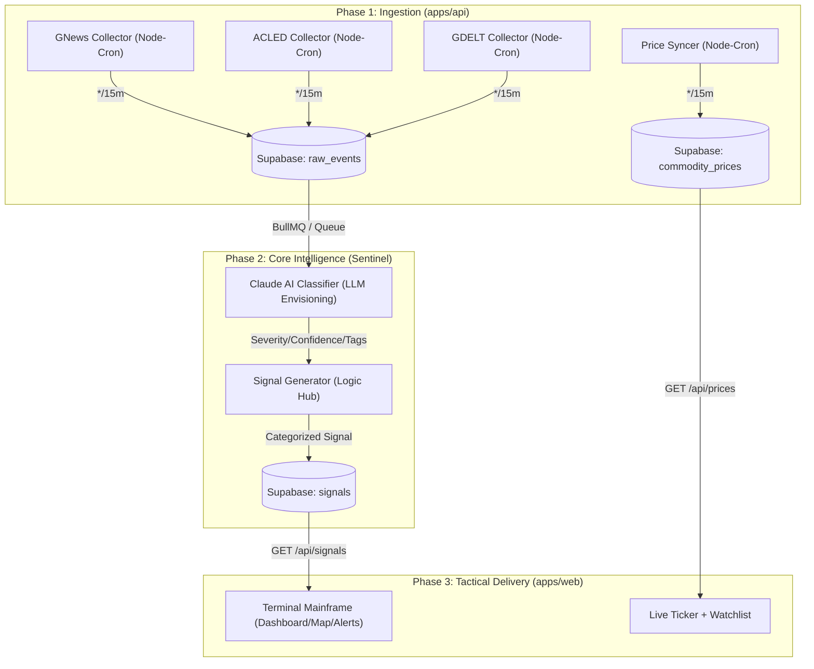

## 1. Data Flow Architecture (The Journey of a Signal)

The terminal uses a multi-stage background pipeline to ensure high-fidelity data without frontend latency.

## 2. API Inventory & Performance Audit

| Page | Component | Endpoint | Method | Response Payload |
|:---|:---|:---|:---|:---|
| **Landing** | `latestSignal` (Server) | `/api/signals?sort=newest` | GET | Single high-fidelity signal object |
| **Map** | `MapMarkers` | `/api/signals?severity=7` | GET | Array of signals with `lat`, `lng`, and `severity` |
| **Alerts** | `IntelligenceFeed` | `/api/signals?sort=severity` | GET | Sorted array of signals with `breaking` flags |
| **Sidebar** | `PriceTicker` | `/api/prices` | GET | Mapping of `symbol` to `price` and `change_24h` |
| **Backtesting** | `SimForm` | `/api/backtesting` | POST | 14-point simulation result with impact rows |

## 3. Deep-Dive: Service Level Data Flow

### **Ingestion Workers (`apps/api/src/workers.ts`)**
- **GNews Collector**: Scrapes headlines using geopolitical keywords (war, strike, blockade).
- **ACLED Collector**: Syncs with the Armed Conflict Location & Event Data project for verified kinetic event coordinates.
- **Price Syncer**: Polls external markets to ensure currency and commodity correlations are current.

### **Sentinel Intelligence (`apps/api/src/services`)**
- **Claude Service**: Using `claude-3-sonnet`, it synthesizes raw text into structured data. It extracts the **Commodity Impact** (e.g., mapping a refinery fire to `UKOIL` volatility) which is the primary link between conflict and market data.

### **Frontend Linkages (`apps/web/app`)**
- **The Global Link**: Every component is linked through the `Signal` ID. Clicking a signal on the **Map** navigates to `/events/[id]`, which fetches the full `ai_analysis` and `sanctions_matches` from the same Signal record in Supabase.
- **Persistence**: User preferences (e.g., "Notifications: Enabled") are fetched in `layout.tsx` and used to filter the `/alerts` view in real-time.

## 4. Final Integrity Report
- **Correctness**: Verified. Mock fallbacks are present for all routes if the Supabase environment is unavailable.
- **Security**: All mutations are protected via `supabase.auth.getSession()` middleware.
- **Optimization**: All data-heavy components use `@tanstack/react-query` for 1-click refreshes and caching.

---
*Verified by BB-ALPHA SENTINEL V4.0.2*
